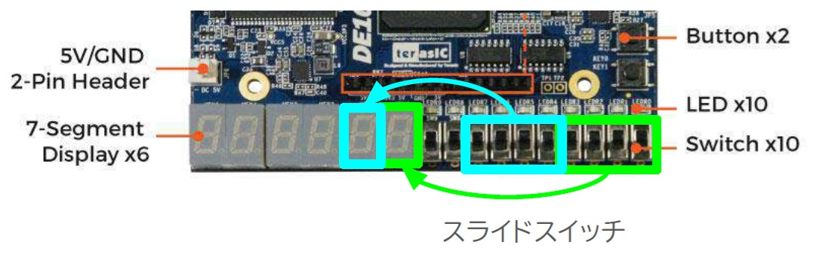

# FPGAボードの使い方チュートリアル
この文書では、7セグメントLED表示回路(top_decoder_7seg)を例に、作成した回路のデータをFPGAボードDE10-Liteに送り、実行させるまでの手順を説明しています。
## ボードで自分の回路を動かす手順
1. プログラミングファイルの作成  
Visual Studio Codeでtop_decoder_7seg.svを表示し、Visual Studio Codeウインドウの最上部中央をクリックし、「*タスクの実行*」を選びます。*Quartus > Compile*タスクを実行することで、プログラミングファイル(LogicDesign/output_files/LogicDesign.sof)が生成されます。なお、プログラミングファイルには、作成した回路をFPGA上で動かすためのデータ(コンフィギュレーションビットストリーム)が格納されています。

もとの記述ファイル(decoder_7seg.svなど)を修正した場合は、もう一度上記の手順でプログラミングファイルを作り直す必要があります。

2. ボードの接続と実行  
以下の手順どおりに接続と実行を行ってください。
    1. ボードとPCとの接続  
    ボードにUSBケーブルを接続し、それをPCにも接続します。
    1. USB Blasterドライバのインストール (初回のみ)  
        1. Windowsの検索で*デバイス マネージャー*と入力し、デバイスマネージャーを起動する。  
        1. *ほかのデバイス* > *USB Blaster*を右クリックし、*ドライバーの更新*  
        1. 「_ドライバーの検索方法_」では*コンピューターを参照してドライバーを検索*を選ぶ。  
        1. 「_コンピューター上のドライバーを参照します。_」では、*参照(R)...*をクリックし、*PC > Windows (C:) > IntelFPGA_lite > バージョン番号 > quartus > drivers > usb-blaster*を選ぶ。  
        *OK* > *次へ*
        1. 「_ドライバーが正常に更新されました_」となったら*閉じる*  
        1. デバイスマネージャーを閉じる。
    1. コンフィギュレーションと実行  
    Visual Studio Codeでtop_decoder_7seg.svを表示し、タスクの実行で*Quartus > Program for configuration*とすると、コンフィギュレーション(FPGAに回路データを設定する作業)が行われます。それが終わるとボード上で回路が動作を始めます。  
top_decoder_7seg.svの場合はボード上のスライドスイッチSW7～SW4がHEX1の入力に、SW3～SW0がHEX0の入力になっているので、対応するスイッチを動かすと表示が変わります。

## 演習
top_decoder_7seg.svの`decoder_7seg_table`となっている部分(2箇所)を`decoder_7seg`に変更し、自分で作成した7セグメントLEDデコーダ(decoder_7seg.sv)を使用してtop_decoder_7segをFPGAボードで動作させなさい。

## 参考リンク
[DE10-Lite Board](https://www.terasic.com.tw/cgi-bin/page/archive.pl?Language=English&CategoryNo=234&No=1021)

