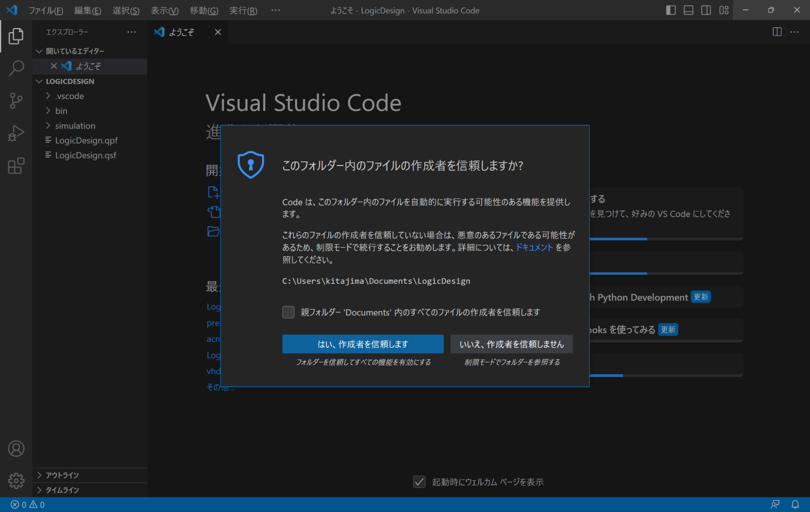
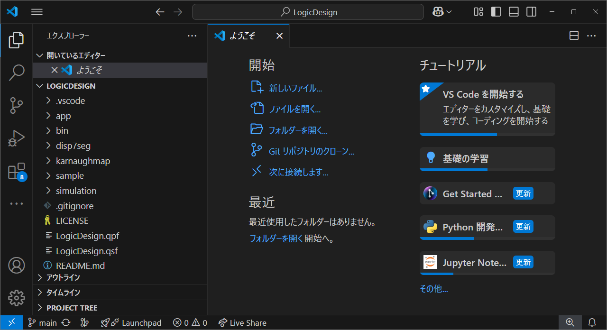
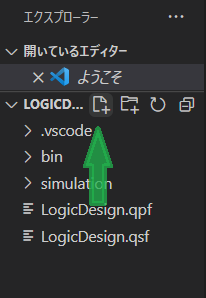
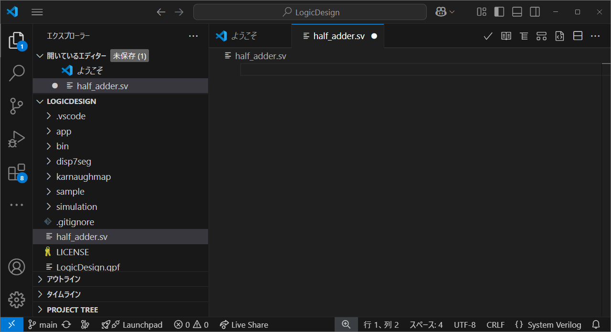
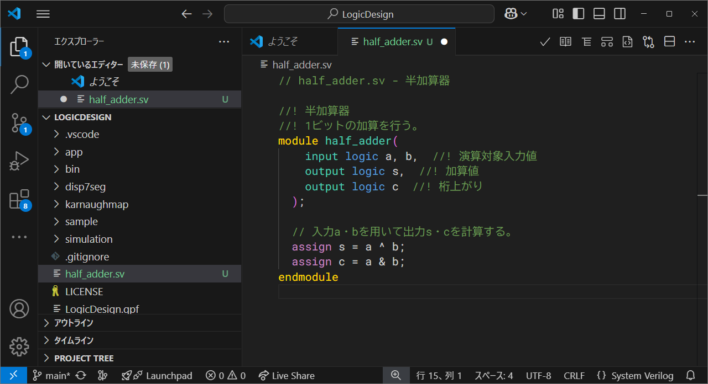
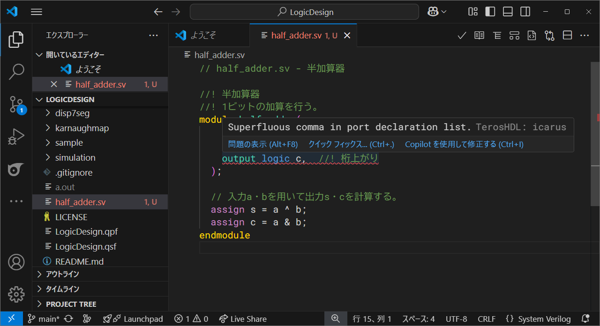
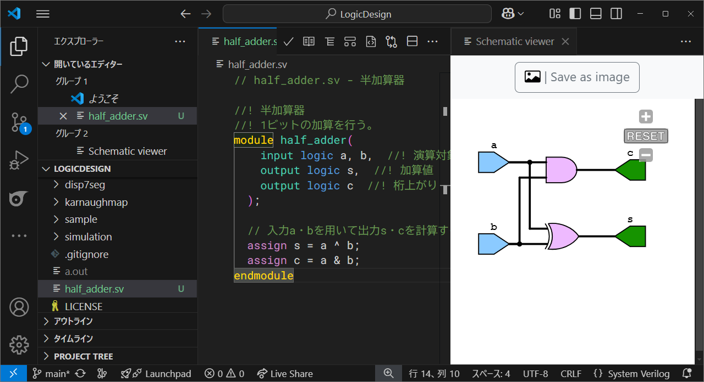

# 論理回路設計ツールチュートリアル

この文書では、LogicDesign環境でSystem Verilogのプログラミング作業をするための基本機能について、例を用いて説明します。

なお、ここにある内容は[LogicDesignのインストール・設定](../../README.md)を終えていることを前提としています。

## Visual Studio Codeを起動する

LogicDesignの設定で作成したショートカットアイコンからVisual Studio Codeを起動してください。通常の方法でVisual Studio Codeを起動しても編集作業は行えますが、シミュレーション等が実行できません。

初回起動時に次のように「このフォルダー内のファイルの作成者を信頼しますか?」と出てきた場合、「はい、作成者を信頼します」を押してください。



初めて起動すると、下図のように、エクスプローラーと書いてある部分が現れています。この部分は画面左側の一番上のアイコンを押すことで表示/非表示を切り替えることができます。



論理設計に関する基本的な作業はVisual Studio Codeで行います。

## ファイルを作成する

マウスカーソルをエクスプローラーに動かすと、下図のようにアイコンが現れます。四つのアイコンの一番左が新規ファイル作成のアイコンです。



新規ファイル作成のアイコンをクリックすると、ファイル名が入力できるようになります。ここでは、「half_adder.sv」と入力してください。ファイル名を間違えるとそれが原因で後でエラーとなる場合があるのでよく確認してください。エンターキーを押すとファイル入力の画面になります。



## ファイルを編集する
次の記述例を入力していきましょう。

```systemverilog:half_adder.sv
// half_adder.sv - 半加算器

//! 半加算器
//! 1ビットの加算を行う。
module half_adder(
    input logic a, b,  //! 演算対象入力値
    output logic s,  //! 加算値
    output logic c  //! 桁上がり
  );


  // 入力a・bを用いて出力s・cを計算する。
  assign s = a ^ b;
  assign c = a & b;
endmodule
```

入力する際に、インデントが自動では上記のとおりにはならない場合があります。それは、入力後にタブの右側にある「✓」アイコンを押すことで整形できます。

コメントを入力するときは、Ctrl + /を押すと便利です。その行に何も書いていなければ、コメントの記号が入力されます。何か書いてある行でCtrl + /を押すとその行がコメントになります。範囲指定してからCtrl + /を押すとその範囲全体がコメントになります。コメントになっている行でCtrl + /を押すとコメントがはずれます(コメントの記号がなくなります)。この機能は範囲指定して行うこともできます。



## ファイルを保存する

ファイルを保存するにはCtrl + Sを入力します。保存前は編集画面のタブ(上部の見出し部分)のファイル名の右隣りに白丸がありますが、保存できている状態では×になります。

### ファイルが書き込めないエラーが発生した場合

文法的なエラーではなく、ファイルが書き込めないという主旨のエラーが出る場合があります。この場合、次の手順を実行してみてください。
1. Windowsのエクスプローラーを開き、プロジェクトのフォルダ(LogicDesign)に移動します。
1. 次の手順でWindows PowerShellを開きます。
   *  (Windows 10の場合) エクスプローラーのメニュー「ファイル」から「Windows PowerShell を開く」を選択し、PowerShellのウィンドウを開きます。
   * (Windows 11の場合) アドレスバーに「powershell」と入力してPowerShellのウィンドウを開きます。
3. 開いたWindows PowerShellで以下のコマンドを1行ずつ実行します。

        attrib -R /S /D *
        attrib -R /S /D .

これは、特にGoogleDriveやOneDriveなどのクラウドストレージサービスのバックアップ対象ディレクトリとなっている場合に起こります。LogicDesignのディレクトリを、バックアップ対象外となる位置に移動させてください。

## 文法誤りの確認を行う

ファイルを保存したとき、下の画面のように赤い波線がつくことがあります。これはその部分やその前後に文法誤りがあることを表します。マウスカーソルを赤い波線がついたテキストに移動させると、エラーメッセージが表示されます。これらを参考にして誤りを訂正してください。



## 回路図を表示する

エラーが無くなったら、回路図を表示して確認しましょう。タブ右側の「✓」アイコンの二つ隣のアイコン(Schematic viewer)を押します。回路図はドラッグしたり拡大縮小できるので、見やすいように調整してください。



## 作業を中断し再開する

作業を中断するには、Visual Studio Codeを終了します。

再開するには、ショートカットアイコンからVisual Studio Codeを起動します。

## 別のファイルを追加する

新しいファイルを作成する場合は、「ファイルを作成する」の手順で行ってください。ダウンロードしたファイルなどを追加する場合は、LogicDesignのフォルダにファイルを置き、Visual Studio Codeのエクスプローラーを開いて追加されたファイルをクリックすれば編集できます。

## 書きかけのファイルを除く

書きかけで未完成のファイルや、エラーが修正できていないけれども次の課題を先に行うなどの場合、LogicDesignの中にwip (work in progress)などの名前のフォルダを作成し、その中にファイルを移動してください。なお、フォルダの名前は任意です。続きの記述を行いたい場合はLogicDesignのフォルダに戻してください。
